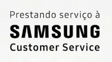

# 📱 Samsung Customer Service - Landing Page

<div align="center">
  
</div>

<br />

<div align="center">
  <a href="https://nextjs.org/"></a>
  <a href="https://react.dev/"></a>
  <a href="https://www.typescriptlang.org/"></a>
  <a href="https://tailwindcss.com/"></a>
  <a href="https://www.sanity.io/"></a>
</div>

<br />

Bem-vindo ao repositório oficial da Landing Page do **Samsung Customer Service - Teresina**.
Este projeto foi modernizado de uma estrutura puramente em HTML/CSS para uma aplicação escalável de alta performance utilizando as tecnologias mais modernas de desenvolvimento web e gerenciamento de conteúdo Server-Side.

## 🚀 Tecnologias e Arquitetura

O ecossistema do projeto foi montado sob as seguintes bases:

- **[Next.js (App Router)](https://nextjs.org/)**: Framework React com **Server-Side Rendering (SSR)** nativo e Static Site Generation (SSG). Garante a melhor performance de carregamento e pontuação máxima no Carga e SEO do Google.
- **[React 19](https://react.dev/)**: Componentização da interface separando as interatividade complexas (ClientLogic) de visualização ultrarrápida (Server Components).
- **[Tailwind CSS v4](https://tailwindcss.com/)**: Estilização moderna via utilitários atrelada aos estilos legados mantidos estrategicamente via importações universais.
- **[Sanity CMS](https://www.sanity.io/)**: Banco de dados *Headless*. Todo o painel de administração de produtos foi diretamente injetado no código e funciona dentro da rota invível `/studio`.
- **[TypeScript](https://www.typescriptlang.org/)**: Tipagem estática imposta no framework e schemas do banco de dados (impedindo qualquer erro crítico em tempo de execução).

## ✨ Principais Funcionalidades

- **Vitrine Dinâmica na Nuvem**: Os produtos expostos na home respondem de forma assíncrona ao que está cadastrado no CMS. Os estoques/preços são atualizados instantaneamente em toda a web pela equipe da loja sem tocar numa linha de código no VScode.
- **Painel Administrativo Embutido**: O gerente acessa a UI em `/studio` no próprio domínio (Vercel) para controlar a estrutura dos produtos.
- **Redirecionamento Inteligente de WhatsApp**: Cada produto da vitrine carrega um texto dinâmico para os vendedores ("*Quero o preço especial do Galaxy S25...*").
- **Performance Animada**: Scroll suave e animações de fade-up acionadas via *Intersection Observer* local — totalmente compatível com SSR graças a separação por Client Hooks modernos.

## 🛠️ Como rodar o projeto localmente

Para simular o ecossistema ou realizar manutenção:

1. **Clone o repositório:**
   ```bash
   git clone https://github.com/laurielmesquita/samsung-landing-page.git
   ```

2. **Instale as dependências (com flag Legacy peer para suprir a engine React 19 no Sanity v3):**
   ```bash
   npm install --legacy-peer-deps
   ```

3. **Inicie o servidor de desenvolvimento:**
   ```bash
   npm run dev
   ```

4. Acesse as rotas disponíveis do Next.js:
   - Visão do Cliente da Loja: `http://localhost:3000`
   - Painel Administrativo CMS: `http://localhost:3000/studio`

## 📁 Estrutura Central (Pós-Conversão)
- `app/page.tsx`: Tela inicial unificada. Puxa dados seguros do Sanity de forma invisível.
- `app/components/ClientLogic.tsx`: Engine de scroll e observers dos cards desatrelado do lado Server.
- `sanity/schemaTypes/product.ts`: Modelo e regras de negócio da estrutura NoSQL do Produto.
- `sanity/client.ts`: Connection Pool entre o Frontend e os servidores da Sanity API.

---

<br />

<div align="center">
  
</div>
